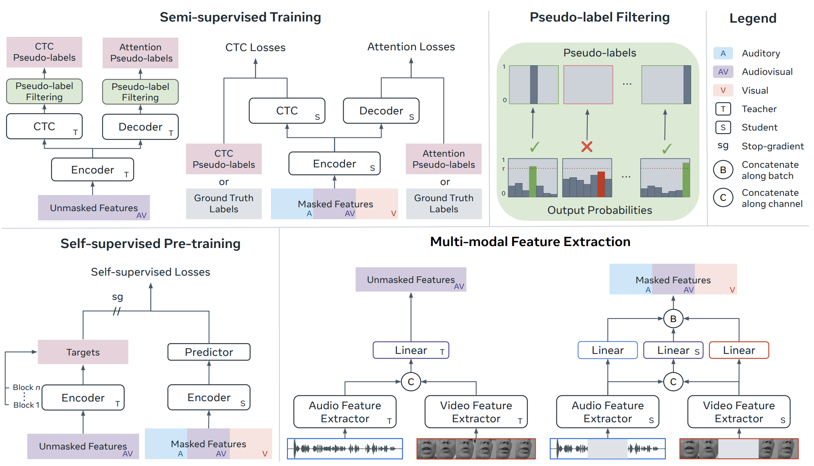

# Unified Speech Recognition

## Introduction
The implementation of the code is based on
[PyTorch Lightning](https://www.pytorchlightning.ai/). We use [Hydra](https://hydra.cc/docs/intro/) for configuration and [Weights and Biases](https://wandb.ai/site) for logging.

## Preparation
### Installation
`conda env create -f environment.yml`. Please change the environment prefix, if necessary, and follow the instructions in fairseq_manual/setup_data_utils.py to setup fairseq.

### Data
1. LRS3, VoxCeleb2, and LRS2 can be downloaded using the following links:
    * [LRS3](https://www.robots.ox.ac.uk/~vgg/data/lip_reading/lrs3.html)
    * [VoxCeleb2](https://www.robots.ox.ac.uk/~vgg/data/voxceleb/vox2.html)
    * [LRS2](https://www.robots.ox.ac.uk/~vgg/data/lip_reading/lrs2.html)
2. The landmarks for face alignment can be obtained using the following face detection and face alignment repos: [RetinaFace](https://github.com/biubug6/Pytorch_Retinaface) and 
    [2-D FAN](https://github.com/1adrianb/face-alignment). Alternatively, they can be downloaded from [this repo](https://github.com/mpc001/Visual_Speech_Recognition_for_Multiple_Languages/blob/master/models/README.md).
3. The following command can be run to crop the mouths (please ensure that the name of the landmark files matches the corresponding video (except for the file extension)):
    ```
    python preprocessing/extract_mouths.py --src_dir ${SOURCE_DIR} --tgt_dir ${TARGET_DIR} --landmarks_dir ${LANDMARKS_DIR}
    ``` 
The videos and the audio should be placed in directories with names as defined in conf/data/default.yaml (alternatively the arguments for the directory names can be changed). The root of the directory paths should be set in data/dataset/paths.
4. Download the data paths with the tokenised labels for [LRS3 test set](https://drive.google.com/file/d/11YvNvz1xdmIvTZR0aN-V67Bl2sR7m8Qh/view?usp=sharing), [LRS3 trainval set](https://drive.google.com/file/d/1SGg7AlCdcvUsty9vGdRn3XFnHIJeFK3v/view?usp=sharing), [LRS3 training set](https://drive.google.com/file/d/1wx_dlXn_ACOQCy7dqZzmVwue8k60srx1/view?usp=sharing), [LRS3 validation test](https://drive.google.com/file/d/1mSme1659RD4iyHN8P1tBEIm7qPgsDFCU/view?usp=sharing), and [LRS3 + VoxCeleb2](https://drive.google.com/file/d/16JRcI3leVGeSYWDesKBfpopTRV_1kx99/view?usp=sharing).


## Demo
The following command can be run to produce the transcription for the example video in the repo (example.avi and example.wav). Please make sure to download a Base model from below and provide the path to the .pth file as shown below:
```
python demo.py model.pretrained_model_path=${MODEL_PATH}
``` 

## Testing
We provide the checkpoints necessary to reproduce the main results (see Table 3). The corresponding bash scripts can be used to run the inference code. Please fill out the missing values .sh script (e.g., place the path of the downloaded test data csv for the "data.dataset.test_csv" argument)

### Low-resource

|     Model    | Pre-training Dataset | V (%) | A (%) | AV (%) | Checkpoint | Bash Script |
|:------------:|:--------------------:|:-----:|:-----:|:------:|:----------:|:-----------:|
|     Base     |         LRS3         |  36.0 |  3.2 |  3.0  | [Download](https://drive.google.com/file/d/1T4uzaVmbzObvTGbtd0kTyoLMwIXViFLL/view?usp=sharing) | scripts/test/base_low_resource_lrs3.sh |
|  Base Plus   |     LRS3+Vox2-en     |  28.4 |  2.6 |  2.5  | [Download](https://drive.google.com/file/d/1Qa0sqrVL4oCsSI8sOEK-9onFwRYwOwmU/view?usp=sharing) | scripts/test/baseplus_low_resource_lrs3vox2.sh |
|    Large     |     LRS3+Vox2-en     |  26.9 |  2.4 |  2.4  | [Download](https://drive.google.com/file/d/1pVxqnfrCqwbyWBJTDmBoV_TS4VGaluPD/view?usp=sharing) | scripts/test/large_low_resource_lrs3vox2.sh |


### High-resource
|     Model    | Pre-training Dataset | V (%) | A (%) | AV (%) | Checkpoint | Bash Script |
|:------------:|:--------------------:|:-----:|:-----:|:------:|:----------:|:-----------:|
|     Base     |         LRS3         |  34.3 |  1.9 |  1.6  | [Download](https://drive.google.com/file/d/1GIeWN5lypCYwrJTpsu4_Zl2m10jX73uk/view?usp=sharing) | scripts/test/base_high_resource_lrs3.sh |
|  Base Plus   |     LRS3+Vox2-en     |  26.5 |  1.6 |  1.3  | [Download](https://drive.google.com/file/d/1bqIvzy9dQZz3Ql6GQxK-RMnMB2s27oVO/view?usp=sharing) | scripts/test/baseplus_high_resource_lrs3vox2.sh |
|    Large     |     LRS3+Vox2-en     |  22.3 |  1.2 |  1.1  | [Download](https://drive.google.com/file/d/1IO2yxaZLG89R4bwtJNc7TaC8UAs08Jtz/view?usp=sharing) | scripts/test/large_high_resource_lrs3vox2.sh |

## Self-Supervised Pre-training
The following scripts can be used to pre-train each of our models using our self-supervised approach. Please note that we use the CTC and attention losses to "probe" the performance of the representations throughout training. Crucially, no corresponding gradient is passed back to the encoder, which would corrupt the self-supervised nature of the task. 

| Model      | Pre-training Dataset | Checkpoint                                                                                                   | Bash Script                         |
|:----------:|:--------------------:|:------------------------------------------------------------------------------------------------------------:|:-----------------------------------:|
| Base       | LRS3                 | [Download](https://drive.google.com/file/d/1AZ3JT8zubow-oZ5LJUrMd97GLWmAKfK0/view?usp=sharing)               | scripts/self/base_lrs3.sh           |
| Base Plus  | LRS3+Vox2-en         | [Download](https://drive.google.com/file/d/1wCxpChDQySPraGICZ9QCW9Nzo-EYtX-g/view?usp=sharing)               | scripts/self/baseplus_lrs3vox2.sh   |
| Large      | LRS3+Vox2-en         | [Download](https://drive.google.com/file/d/18dBUcP9XvRIVZmDw8XTpxD8DKReTpOSI/view?usp=sharing)               | scripts/self/large_lrs3vox2.sh      |

## Semi-Supervised Training 
The following scrips can be used to train each of the models for the low- and high-resource settings. To obtain the best results (those presented in Table 3 of the paper), the path for the self-supervised pre-trained model needs to be specified in the bash scrips ("model.pretrained_model_path"). The model can be also trained from scratch by leaving that argument blank.

### Low-resource
| Model      |        Dataset        | Bash Script                            |
|:----------:|:--------------------:|:-----------------------------------:|
| Base       | LRS3                 | scripts/semi/base_low_resource_lrs3.sh  |
| Base Plus  | LRS3+Vox2-en         | scripts/semi/baseplus_low_resource_lrs3vox2.sh       |
| Large      | LRS3+Vox2-en         | scripts/semi/large_low_resource_lrs3vox2.sh          |

### High-resource
| Model      |        Dataset        | Bash Script                            |
|:----------:|:--------------------:|:-----------------------------------:|
| Base       | LRS3                 | scripts/semi/base_high_resource_lrs3.sh  |
| Base Plus  | LRS3+Vox2-en         | scripts/semi/baseplus_high_resource_lrs3vox2.sh       |
| Large      | LRS3+Vox2-en         | scripts/semi/large_high_resource_lrs3vox2.sh          |

## Citation
If you find this repo useful for your research, please consider citing the following:
```bibtex
@article{haliassos2024unified,
  title={Unified Speech Recognition: A Single Model for Auditory, Visual, and Audiovisual Inputs},
  author={Haliassos, Alexandros and Mira, Rodrigo and Chen, Honglie and Landgraf, Zoe and Petridis, Stavros and Pantic, Maja},
  journal={arXiv preprint arXiv:2411.02256},
  year={2024}
}
```